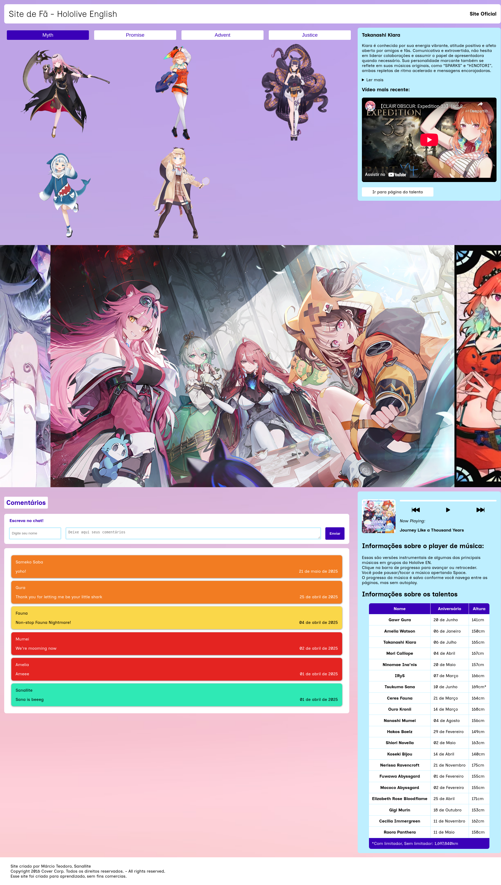
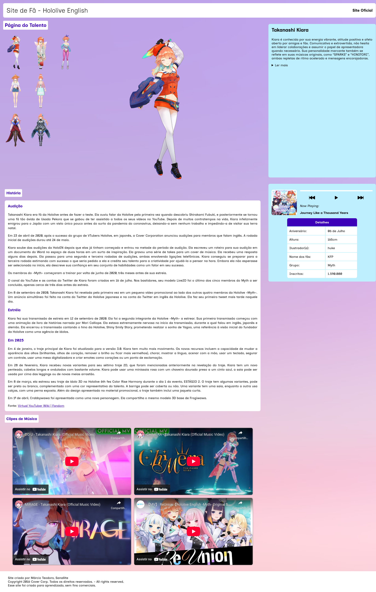

# Projeto Hololive

## Link do Site
[https://sanallite-hololive.web.app](https://sanallite-hololive.web.app)

## Objetivo da Aplicação
Apresentar os talentos da [Hololive](https://hololivepro.com/en), a maior agência de Virtual YouTubers femininas do mundo. [VTubers](https://pt.wikipedia.org/wiki/YouTuber_Virtual) são criadores de conteúdo digital focado em transmissão ao vivo de jogos, também entrando em música e dança e outras áreas. A hololive English é a sua vertente ocidental, que contém atualmente 15 talentos, ou idols, como também são chamados, divididos em quatro "gerações". A hololive English teve sua estréia em 2020, com o "debut" das streamers do grupo Myth. A [Cover Corp](https://cover-corp.com/en), empresa pai da hololive, também tem uma agência focada em talentos masculinos, chamada [HOLOSTARS](https://holostars.hololivepro.com).

Virtual YouTubers ainda é uma categoria pouco conhecida no Brasil, e este site ajuda a divulgar os talentos para o nosso público, trazendo informações em Português, com links diretos para o conteúdo original.

> [!IMPORTANT]
> Este é um projeto de aprendizado sem fins comerciais, todos os direitos sobre a marca Hololive e seus talentos são reservados a Cover Corporation.
>
> Os códigos são de minha autoria e estão protegidos sob a licença [GNU GPL-3](LICENSE)

>[!WARN]
> Atualmente o site não é completamente compatível com o navegador Firefox e derivados, devido a estilização das páginas, mas está planejada a correção disso.

## Objetivo do Desenvolvimento
Este é um "projeto de paixão" feito por mim devido ao meu grande apreço pelos talentos da Hololive, e também para aprofundar, praticar e integrar meus conhecimentos de desenvolvimento web, focando no lado front-end. A ideia desse site começou em 2023, foi feito um protótipo no [Figma](https://www.figma.com/pt-br/) de como deveria ser a interface, e a criação de um site estático com pouca estilização. Em março de 2025 pude finalmente retornar ao projeto podendo dedicar meu tempo a ele, criando um site dinâmico e responsivo.

[Protótipo inicial da interface, feito em 2023](documentacao/Prototipo%20Projeto%20Hololive.pdf)

[Acesse a documentação completa aqui.](documentacao/ProjetoHololive.txt)

## Arquitetura
* Banco de dados local com arrays e objetos JS, exportados como módulos.
* Códigos Javascript foram escritos seguindo o padrão ES2015+.
* CSS utilizando Grid e Flexbox, variáveis, Media Queries e Keyframes.
* HTML com elementos semânticos e arquivos passados pela validação do [Markup Validation Service](https://validator.w3.org) da W3C.
* Integração com o [Firebase](https://firebase.google.com/?hl=pt-br) Cloud Firestore para hospedar um banco de dados simples para a seção de comentários.
* Integração com a [API do YouTube](https://developers.google.com/youtube/v3?hl=pt-br) para ter os uploads e o número de inscritos mais recentes dos canais dos talentos.
* LocalStorage e SessionStorage para salvar os úlitmos grupo e talento vistos e a última música tocada, incluíndo o momento onde a música foi parada.
* O único framework utilizado foi o [Vite](https://vite.dev) para criar um servidor local compatível com ES Modules, importar variáveis de ambiente e fazer as builds de produção.
* Utilização do Firebase para hospedagem do site, com deploy automático pelo Github utilizando workflows.

## Funcionalidades
* Uma página com a história e mais informações de cada talento, incluindo suas roupas alternativas.
* Um tocador de músicas interativo.
* Seção de comentários com a estética dos "Super Chats" do YouTube. Porém não é permitido editar ou remover os comentários. Também só é permitido comentar a cada cinco minutos.
* Vídeos do YouTube integrados as páginas.
* Carrossel de imagens automático, que pode ser pausado/retomado com duplo clique nas imagens.

## Capturas de Tela

## Contato
[LinkedIn](https://www.linkedin.com/in/márcio-rodriguês-teodoro-6b9511303)